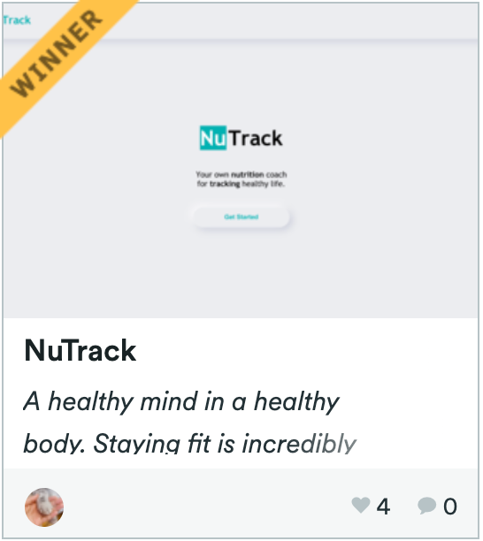
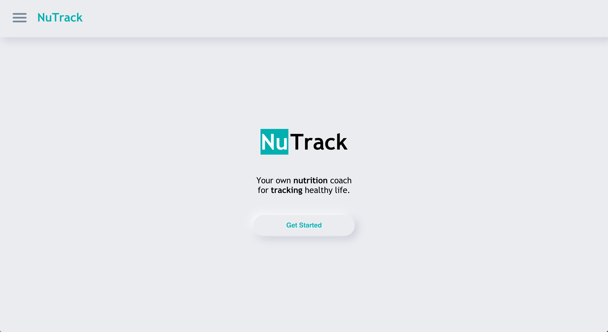
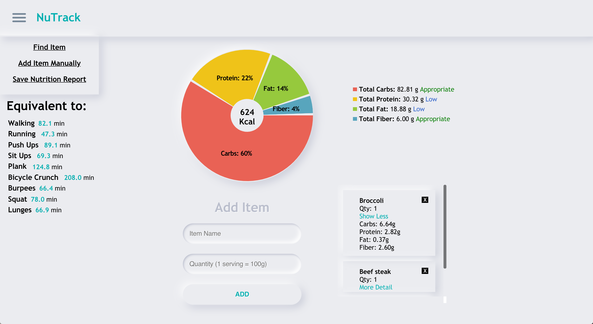
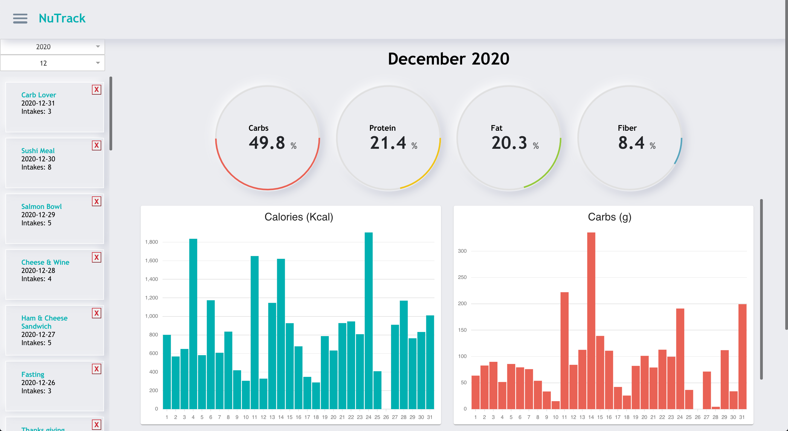
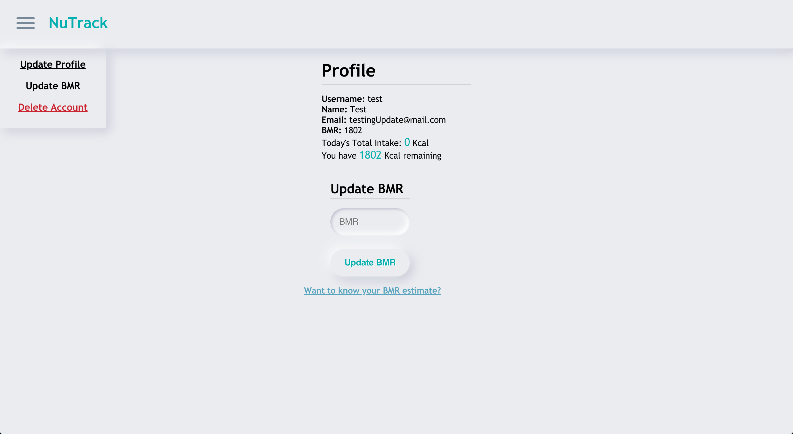
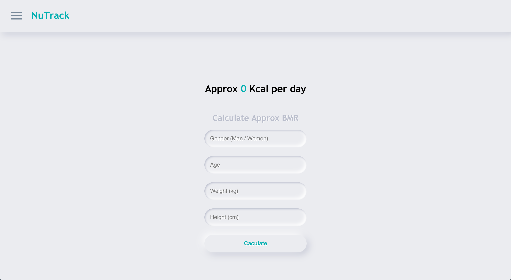
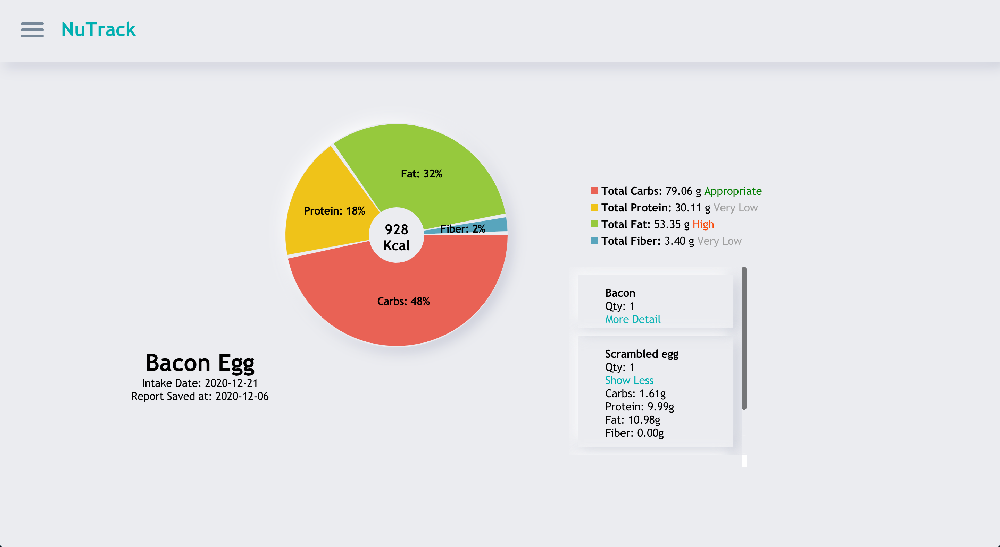

## Inspiration:
A healthy mind in a healthy body. Staying fit is incredibly important in maintaining your mental health. A lot of people around me complain about weight problem after Covid. You move less, and naturally, you gain weight. Weight is not just about looking good. There was a TV program about personal trainers gaining their weight before starting the training with their clients. The result was shocking. They all had health issues, but besides that, the trainers began to feel down. They started to have a depressing feeling, and many had problems with their family. In this era of the pandemic, mental health has become a severe issue. I believe that the first barrier to protect our soul is to build our physical body as hard as possible. That is the reason why I invented this web page. Through tracking your nutritional intake and simply following suggested quiet in-door workout, you will feel better. Your healthier body will give you the strength to overcome downside feelings which often come these days.
<br/><br/><br/>

## Award & Honor:
  - First Runner-up from Hacking for Humanity : Health Systems of The New Normal
  <div>
    
    
  </div><br/><br/><br/>

## Installation:
1. Clone repository
```bash
$ git clone https://github.com/jyon124/NuTrack.git
```
2. cd into project directory
```bash
$ cd nutrack/
```
3. Install all npm packages
```bash
$ npm install
```
4. Run npm development script
```bash
$ npm start
```
5. Browse to http://localhost:3000
<br/><br/><br/>

## External API:
### Rapid API:
https://rapidapi.com/marketplace
<br/><br/><br/>

## Features:
### 1. Nutrtition Intake Estimate page:
  - User can track what they are eating with calorie and nutrition facts.
  - User can add the food or ingredient by simply searching the item name and quantity (1 serving equals to 100g). 
  - If the entered item was not found, user can add the item manually by fill out the nutrition form. 
  - On nutrition facts, user can check certain nutrition intake is very high, high, appropriate, low or very low next to the legend. 
  - User can see the nutrition detail of item by clicking more detail button from the card. 
  - User can see what amount of workout they should do to consume what they just ate.
  
### 2. BMR Estimate page:
  - User can estimate their BMR(Basal metabolic rate) by fill out the form.

### 3. Overview page (login required):
  - User can track their monthly food intake along their timeline. 
  - User can choose a certain year and month to track their intakes. 
  - User can click each saved report to view furthermore details.
### 4. Account page (login required):
  - User can check their account information and how many calories they’ve taken today. 
  - If it exceeds their saved BMR(Basal metabolic rate), then it displays exercise suggestions to burn it. 
  - From the left corner of the submenu, user can update their account information, BMR or they can delete their account permanently.
<br/><br/><br/>

## Sample images:
<div>
  
  
  
  
  
  
</div>
